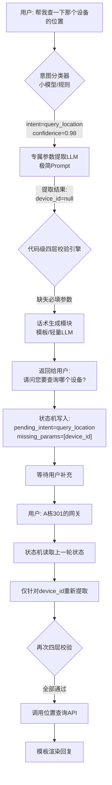

# Agent 意图识别与追问澄清机制：生产级工程化完全指南

## 1. 核心设计理念：从“黑盒魔法”到“白盒组件”

### 1.1 为什么不能把整条链路交给 LLM “一把梭哈”？

将 `用户提问 -> 意图分析 -> 装载工具 -> 规划步骤 -> LLM执行 -> 生成回复` 全部塞给单一 LLM Prompt 处理，虽然在 Demo 阶段开发极快，但在真实生产环境中存在三大致命缺陷，这也是所有 Agent 团队最终都会走向架构重构的根本原因：

- **上下文污染与注意力稀释**：当 50+ 工具的 Schema、通用 ReAct 指令、历史对话全部塞进一个 Prompt 时，LLM 的注意力被大量无关信息稀释。真正需要的关键参数提取指令反而容易被忽略，导致“工具选对了但参数提错了”或“该追问却直接编造了参数”等隐蔽 Bug。
- **优化粒度丢失与迭代僵局**：所有环节强耦合在同一个 System Prompt 中。想优化追问体验就得改整个 Prompt，改完可能又影响了工具选择的准确率；想提升某个参数的提取精度，又怕破坏了其他意图的理解。**牵一发而动全身，导致团队不敢动、无法持续迭代**。
- **容错边界模糊与故障定位难**：选错工具、提错参数、生成不当回复混杂在同一个 CoT 输出中。线上出问题时，你无法区分是意图分类错了、参数提取错了还是下游 API 返回异常，只能靠人肉翻日志猜，修复周期极长。

### 1.2 生产级 Agent 的第一性原理：铁三角平衡

Agent 工程化的本质不是追求“更像人”，而是在追求一个不可妥协的工程三角：

> **降低 Token 消耗 + 增加结果确定性 + 减少响应时间**

这三者互为制约，而分层架构是唯一能同时逼近三者最优解的路径：

| 维度           | 纯 ReAct 一把梭哈                            | 分层意图识别架构                      | 核心收益         |
| -------------- | -------------------------------------------- | ------------------------------------- | ---------------- |
| **Token 成本** | 每次请求全量加载所有工具 Schema + 完整思考链 | 按需加载最小上下文，高频环节零 Token  | 成本降低 60%-90% |
| **结果确定性** | 概率性决策，“要不要追问”也是 LLM 猜的        | 代码规则兜底，校验逻辑 100% 确定      | 幻觉率下降 80%+  |
| **响应延迟**   | 完整 CoT 推理，通常 3-8s                     | 简单查询 <500ms，复杂任务才走完整推理 | P99 延迟可控     |
| **可观测性**   | 黑盒，只能看最终输出                         | 每个模块独立埋点，链路追踪清晰        | 故障定位分钟级   |

> **核心认知升级**：让 LLM 做整条链路，是把 AI 当“黑盒魔法”用；把链路拆解后让 LLM 做专精环节，是把 AI 当“白盒组件”用。前者适合探索，后者才是能扛业务的产品。

------

## 2. 追问澄清的标准处理流程（含状态机）

当用户输入模糊（如“帮我查一下那个设备的位置”）时，追问绝不是 LLM 的即兴发挥，而是一个由代码驱动的确定性工程流程。

### 2.1 完整流程图解



### 2.2 LLM 参与度精细拆解

在追问流程中，LLM 并非全程参与，而是作为精密部件按需调用：

| 流程环节            | 是否用 LLM | 具体实现方式                                                 | 耗时/成本               |
| ------------------- | ---------- | ------------------------------------------------------------ | ----------------------- |
| **意图分类**        | ❌ 通常不用 | BERT 微调 / 关键词规则 / 向量检索，冷启动可用 LLM 标注数据后替换 | <20ms / 零 Token        |
| **参数提取**        | ✅ 必须用   | 专属小参数模型或 GPT-4o-mini，Prompt 仅包含当前意图的 Schema + Few-shot | 200-500ms / 极低 Token  |
| **完整性&格式校验** | ❌ 完全不用 | 正则、类型检查、枚举比对、候选检索，纯代码逻辑               | <5ms / 零成本           |
| **追问话术生成**    | ⚠️ 条件触发 | 高频场景预置模板；复杂/个性化场景用轻量 LLM 生成（Prompt 仅含缺失字段+用户原文） | 模板0ms / LLM 100-300ms |
| **多轮状态管理**    | ❌ 完全不用 | Redis / 数据库存储对话状态机，不依赖 Context Window          | <10ms / 零 Token        |
| **最终执行**        | ✅ 视复杂度 | 简单查询→API+模板渲染；复杂推理→专属 ReAct Agent             | 按需                    |

------

## 3. 追问触发的四层校验体系（附代码示例）

“没提取到参数就追问”只是最基础的起点。生产级 Agent 的判断是一个多层漏斗，每一层都由代码确定性把控，绝不交给 LLM 自行判断。

### 3.1 第一层：必填缺失校验

- **触发条件**：参数提取器返回 `null` / 空字符串 / 占位符（如 "未提及"），且该参数在 Schema 中标记为 `required: true`。
- **决策方**：代码硬校验，100% 确定。
- **追问方式**：开放式提问。
- **避坑**：要过滤 LLM 常见的幻觉占位符，如 `"unknown"`、`"N/A"`、`"待补充"` 等都应视为 null。

### 3.2 第二层：格式/值域校验（最易被忽略的关键层）

- **触发条件**：参数提取到了但不合法。这是把无效请求挡在外部 API 之外的最后一道防线。

- 常见场景

  ：

  - ID 格式错误：提取出 `device_id="abc"`，但系统规定必须是纯数字或 UUID
  - 日期格式不兼容：提取出 `"下周三"`，但 API 只接受 `YYYY-MM-DD` 且无法自动转换
  - 枚举值越界：提取出 `status="坏了"`，但合法值只有 `["online", "offline", "maintenance"]`
  - 数值范围超限：提取出 `limit=10000`，但 API 最大支持 100

- **决策方**：正则、类型转换、枚举集合比对等纯代码逻辑。

- **追问方式**：**纠正式提示**，明确告知错在哪、正确格式是什么，而非让用户猜。

### 3.3 第三层：歧义/多候选冲突消解

- **触发条件**：参数合法但对应多个可能结果，Agent 不确定用户指的是哪一个。

- 典型场景

  ：

  - 用户说“查一下服务器”，系统中有 3 台服务器名称都包含“服务器”
  - 用户说“重启那个服务”，当前上下文中有 2 个服务都处于异常状态
  - 用户提到的人名/项目名存在同名情况

- **决策方**：参数提取后增加一步“候选检索”，结果数 > 1 即触发。

- **追问方式**：**选项式选择**，绝不使用开放式追问。提供带编号/按钮的选项列表，用户点击即可，大幅降低交互摩擦。

### 3.4 第四层：置信度兜底防护

- **触发条件**：参数提取到了、格式也对、无歧义，但**提取过程本身不可靠**。

- 触发阈值

  ：

  - 参数提取 LLM 返回结果的 `confidence < 0.85`
  - 上游意图分类置信度偏低（如 0.75-0.85），此时参数提取的可信度应相应提高要求
  - 敏感操作（删除、修改配置、转账等）无论置信度多高都强制确认

- **决策方**：代码阈值判断。

- **追问方式**：**确认式反问**，复述理解让用户确认，而非重新提问。

### 3.5 完整校验引擎伪代码

```python
def should_clarify(intent: str, extracted_params: dict, schema: Schema, confidence: float) -> ClarifyResult:
    # 第1层：必填缺失（过滤幻觉占位符）
    NULL_PLACEHOLDERS = {"null", "none", "unknown", "n/a", "未提及", "待补充"}
    for field in schema.required_fields:
        value = extracted_params.get(field)
        if value is None or str(value).lower() in NULL_PLACEHOLDERS:
            return ClarifyResult(action=MISSING_REQUIRED, field=field)
    
    # 第2层：格式/值域校验
    for field, value in extracted_params.items():
        validation = validate_field(value, schema.fields[field])
        if not validation.is_valid:
            return ClarifyResult(
                action=INVALID_FORMAT, 
                field=field, 
                invalid_value=value,
                error_message=validation.error_msg
            )
    
    # 第3层：歧义消解
    candidates = resolve_candidates(intent, extracted_params)
    if len(candidates) > 1:
        return ClarifyResult(action=AMBIGUOUS, candidates=candidates[:5])  # 最多展示5个选项
    
    # 第4层：置信度兜底（敏感操作强制确认）
    is_sensitive = intent in SENSITIVE_INTENTS
    threshold = 0.95 if is_sensitive else CONFIDENCE_THRESHOLD
    if confidence < threshold:
        return ClarifyResult(action=LOW_CONFIDENCE, extracted_params=extracted_params)
    
    # 全部通过，无需追问
    return ClarifyResult(action=NONE)
```

### ⚠️ 核心避坑指南

> **永远不要让 LLM 自己判断“是否需要追问”。** 不要写类似 “请分析用户输入，如果信息不足请追问，否则提取参数并执行” 的 Prompt。LLM 可能认为信息“够了”但其实不够（幻觉执行），也可能认为“不够”但其实够用（过度追问烦扰用户），且每次都要消耗 Token 做这个本可零成本完成的判断。 **正确做法**：LLM 只负责“提取”和“生成追问话术”，“是否追问”这个决策永远由代码规则来做。

------

## 4. 进阶技巧与生产最佳实践

### 4.1 让追问更智能、体验更好

- **优先提供选项而非开放提问**：发现参数缺失后，先调接口获取用户有权限的候选列表嵌入追问话术。用户点击/回复编号即可，比打字效率高一个数量级。
- **支持模糊匹配与静默纠错**：在参数提取 Prompt 中加入 Few-shot 纠错示例，或在代码层做编辑距离/拼音相似度校验。匹配成功直接使用并在回复中轻提示（“已为您匹配到设备 A-001”），失败再追问确认。避免对用户的小笔误过度反应。
- **严格区分必填与可选缺失**：只有必填缺失才追问；可选参数缺失时使用合理默认值，并在回复中**主动告知默认值**（“已为您查询最近24小时的数据，如需指定时间请告知”）。避免过度追问导致用户烦躁流失。
- **设置追问次数熔断机制**：同一意图连续 3 轮无法提供有效参数时，自动转人工客服或推送帮助文档链接，避免陷入“AI 反复问、用户答不上来”的死循环。
- **追问话术人格一致性**：即使使用模板，也要保持与 Agent 整体人设一致。避免模板话术过于机械冰冷，可在模板中预留 `{user_name}`、`{context_hint}` 等变量做个性化填充。

### 4.2 多轮状态保持的工程实现

当用户补充信息后，系统必须准确记住上一轮的追问上下文，避免补充信息被误识别为新意图。**不要依赖 LLM Context Window 做状态记忆**，Context Window 有长度限制且会随对话增长增加成本和延迟。

推荐方案：**显式状态机 + 外部存储**

```json
// Redis 中存储的对话状态示例
{
  "session_id": "sess_abc123",
  "current_intent": "query_device_location",
  "pending_params": ["device_id"],
  "confirmed_params": {"building": "A栋"},
  "clarify_count": 1,
  "last_clarify_type": "MISSING_REQUIRED",
  "created_at": "2024-01-15T10:30:00Z",
  "ttl": 1800
}
```

- 用户补充信息时，先读取状态机，仅针对 `pending_params` 重新提取，跳过意图分类环节。
- 状态机设置 TTL（如 30 分钟），超时自动清除，避免脏状态干扰新对话。
- 支持跨会话恢复：用户中途离开再回来，仍可继续之前的追问流程。

### 4.3 可观测性与持续迭代

分层架构的最大优势之一是**每个模块可独立度量、独立优化**：

| 监控指标                      | 对应模块     | 优化方向                               |
| ----------------------------- | ------------ | -------------------------------------- |
| 意图分类准确率 / 混淆矩阵     | 意图分类器   | 补充 Bad Case 训练数据、调整阈值       |
| 参数提取成功率 / 各字段缺失率 | 参数提取 LLM | 优化 Few-shot、微调小模型、调整 Schema |
| 追问触发率 / 追问后完成率     | 校验引擎     | 调整校验规则、优化默认值策略           |
| 各层耗时 P50/P99              | 全链路       | 缓存热点数据、模型量化、异步处理       |
| 用户负反馈率 / 转人工率       | 端到端体验   | 分析 Bad Case 归属模块，针对性修复     |

### 4.4 落地路径建议

不要追求一步到位的完美架构，**渐进式重构**是最稳妥的路径：

1. **Phase 1**：从最高频、最确定的意图（如简单查询类）开始拆分，验证 Token 降本和确定性提升的收益。
2. **Phase 2**：补齐四层校验体系和状态机，覆盖 Top 10 高频意图。
3. **Phase 3**：建设可观测性看板，基于数据驱动持续优化各模块。
4. **Phase 4**：逐步扩展到低频、复杂意图，最终完成全量迁移。

> **最后提醒**：架构是为业务服务的。如果某个意图日均请求量只有个位数，且对准确性要求不高，保留 ReAct 一把梭哈完全合理。**不要为了架构而架构，只为有足够 ROI 的场景投入工程化改造。**